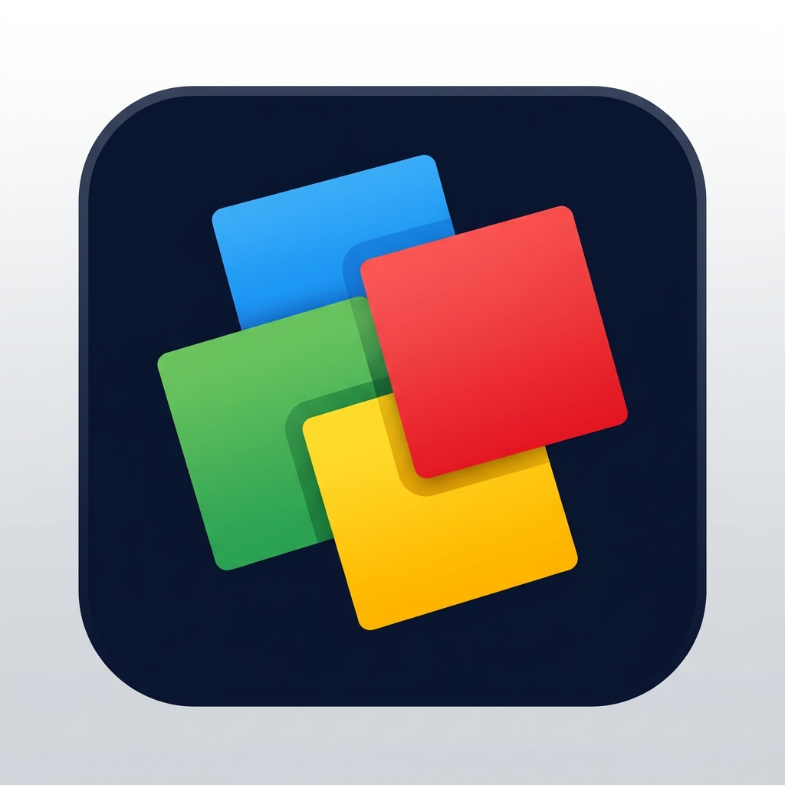
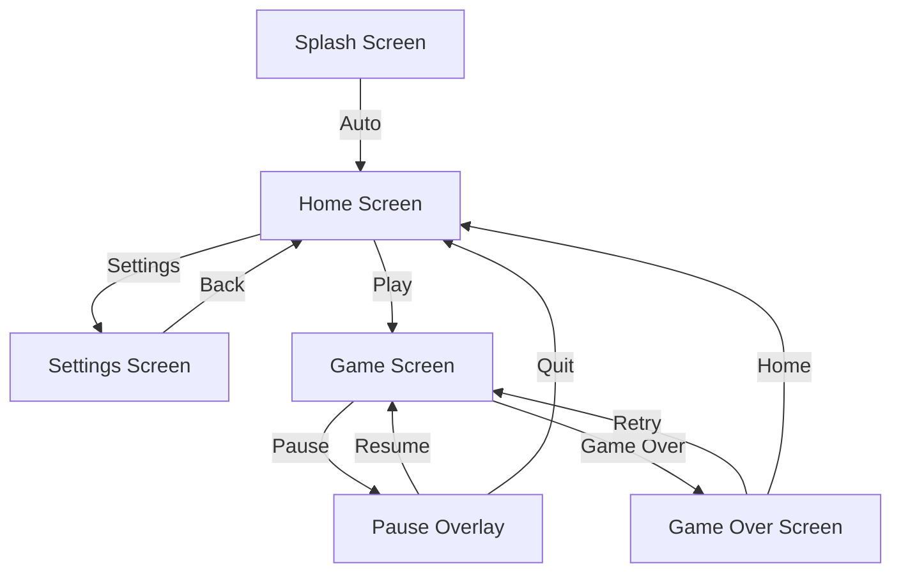
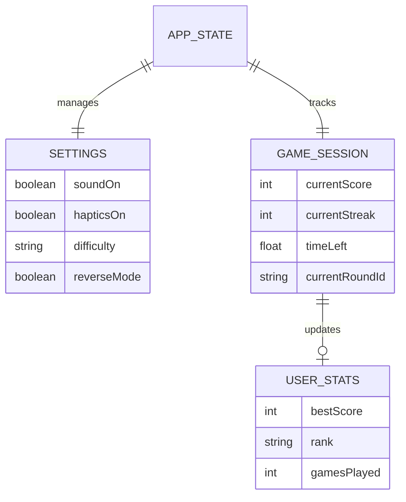

# Color Command: Brain Training & Reflex Game

A high-performance, reflex-based "Stroop Effect" game built with React Native and Expo. Challenge your brain to ignore the ink color and tap what the word actually says.



## Features

- **Stroop Effect Mechanics**: Training your brain to focus on semantic meaning over visual cues.
- **Dynamic Difficulty**: The timer gets faster as your score increases.
- **Streak System**: Build combos to get bonus points and "on fire" status.
- **Cross-Platform**: Works seamlessly on iOS and Android.
- **Premium UI**: Sleek dark mode design with vibrant color palettes and smooth animations.
- **Haptic Feedback**: Physical response for correct/wrong taps (device dependent).
- **Responsive Design**: Adapts perfectly to all screen sizes, from small phones to large tablets.
- **Monetization**: Integrated Google AdMob for banner and interstitial ads.

## Architecture & Logic

### User Flow


### Entity Relationship (ER) Diagram


## Tech Stack

- **Framework**: [Expo](https://expo.dev/) / React Native
- **Icons**: [Lucide React Native](https://lucide.dev/)
- **Haptics**: `expo-haptics`
- **Animations**: `Animated` API (React Native)
- **Safe Area**: `react-native-safe-area-context`

## Getting Started

### Prerequisites

- Node.js (v18 or newer)
- npm or yarn
- Expo Go app on your phone (for testing)

### Installation

1. Navigate to the project directory:
   ```bash
   cd color-command-rn
   ```

2. Install dependencies:
   ```bash
   npm install
   ```

3. Start the development server:
   ```bash
   npx expo start
   ```

4. Scan the QR code with your camera (iOS) or Expo Go app (Android) to play on your device.

## Game Modes

- **Standard**: Tap the color that matches the word's text.
- **Reverse Mode**: Tap the color that matches the ink color (Enable in Settings).
- **Trap Mode**: After score 15, the ink and word may match to trick you.

## Assets

- **Logo**: Custom generated professional minimalist logo.
- **Sounds**: (Optional) Integrated via `expo-av`.
- **Icons**: Vector-based Lucide icons.

## Build Management

To automatically increment the build number for Android and iOS, run:
```bash
npm run bump-build
```
This will update `versionCode` (Android) and `buildNumber` (iOS) in `app.json`.

## APK Build

To create an Android APK for testing:

1. Install EAS CLI:
   ```bash
   npm install -g eas-cli
   ```
2. Log in to your Expo account:
   ```bash
   eas login
   ```
3. Run the build command:
   ```bash
   eas build -p android --profile preview
   ```
4. Once the build is finished, you can download the APK from the link provided in the terminal.

## AdMob Verification (app-ads.txt)

To safeguard your ad earnings and fight fraud, you must host the `app-ads.txt` file on your developer website:

1.  Copy the `app-ads.txt` file from the root of this project.
2.  Upload it to the root of your developer website (e.g., `https://brilworks.com/app-ads.txt`).
3.  Ensure your website URL is correctly listed in the Google Play Console and Apple App Store Connect.
4.  Wait 24-48 hours for AdMob to crawl and verify the file.

## License

MIT © Brilworks 2026
