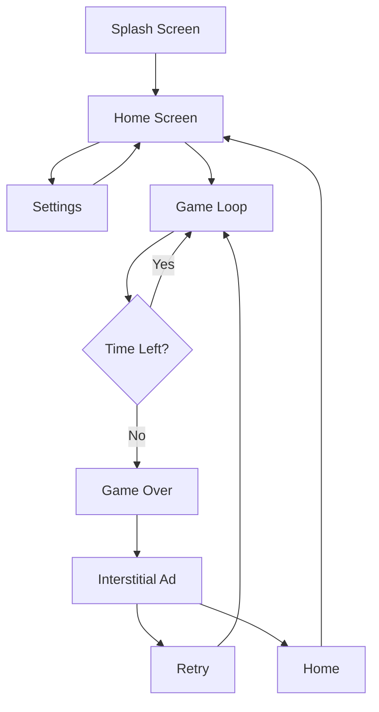
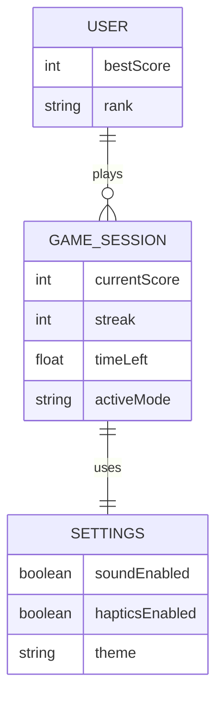

# Color Command: Brain Training & Reflex Game

<p align="center">
  
</p>

Color Command is a high-performance cognitive training application built with **React Native** and **Expo**. It utilizes the "Stroop Effect" to enhance neural plasticity, focus, and mental processing speed.

## 🚀 Tech Stack
- **Framework**: React Native (Expo SDK 54)
- **Styling**: Vanilla Stylesheet with dynamic theme tokens
- **Animations**: React Native Reanimated & LayoutAnimations
- **Audio**: Expo-AV (High-quality haptic & sound feedback)
- **Icons**: Lucide React Native
- **Ads**: Google Mobile Ads (AdMob)

## 🎮 Game Features
- **Cognitive Training**: Scientifically-backed mechanics to improve inhibitory control.
- **Dynamic Difficulty**: Real-time timer scaling that adapts to your performance.
- **Three Challenge Modes**:
  - **Standard**: Match the word text.
  - **Reverse**: Match the ink color.
  - **Trap Mode**: Advanced cognitive traps (Word/Ink matches).
- **Global Feel**: Professional navy-blue aesthetic with "On Fire" streak systems.

## 📊 Architecture & Diagrams

### User Flow


### Data Model (State Relationship)


## 🚀 Tech Stack
- **Framework**: React Native (Expo SDK 54)
- **Styling**: Vanilla Stylesheet with dynamic theme tokens
- **Animations**: React Native Reanimated & LayoutAnimations
- **Audio**: Expo-AV (High-quality haptic & sound feedback)
- **Icons**: Lucide React Native
- **Ads**: Google Mobile Ads (AdMob)

## 📦 Deployment

### Automated Builds (Recommended)
We use a custom auto-incrementing script to ensure every build has a unique version number, preventing Store submission errors.

**For iOS (App Store):**
```bash
npm run build:ios
```

**For Android (Play Store):**
```bash
npm run build:android
```

### Manual Build Steps
1. Increment build numbers: `npm run bump-build`
2. Android (AAB): `eas build -p android --profile production`
3. iOS (IPA): `eas build -p ios --profile production`

### Web (Vercel)
The web version is optimized for Vercel deployment.
1. Export the web project: `npm run build-web`
2. Deploy the `dist` folder to Vercel: `vercel deploy ./dist`

## 🛠 Setup & Development

1. Install dependencies:
   ```bash
   npm install
   ```
2. Start development server:
   ```bash
   npx expo start
   ```
3. Test on different platforms:
   - Press `a` for Android
   - Press `i` for iOS
   - Press `w` for Web

## 🔒 Privacy & Safety
- **No Data Collection**: All scores are stored locally via device persistence.
- **Restricted Permissions**: Explicitly disabled microphone and recording permissions for user safety.
- **AdMob Integration**: Follows Google Play's Family Policy for ad content.

## 📄 Legal
The `website/` folder contains the official landing page, Privacy Policy, and Terms of Service. These must be hosted on your developer domain for Play Store verification and AdMob `app-ads.txt` compliance.

---
MIT © Brilworks 2026
