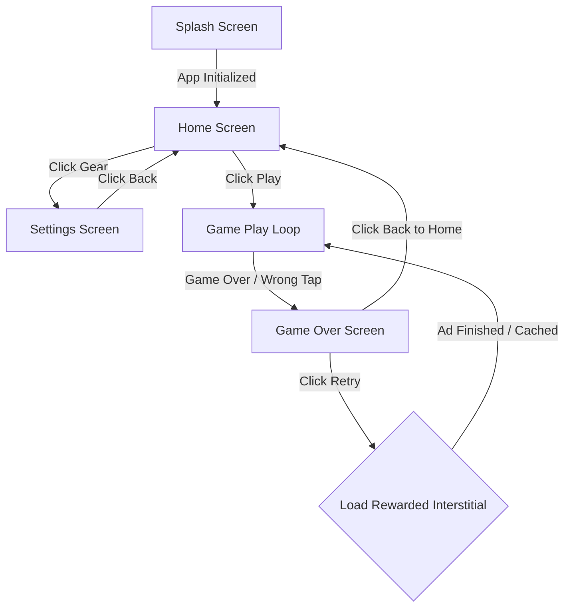
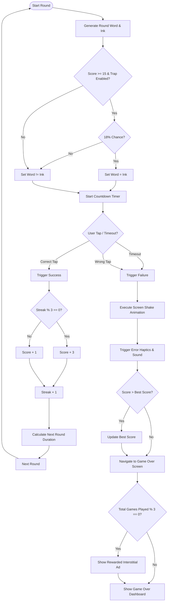

# Color Command: Brain Training & Reflex Game

<p align="center">
  
</p>

<p align="center">
  <strong>A premium, high-octane cognitive training application built with React Native and Expo, designed to push inhibitory control and reaction speed to their limits.</strong>
</p>

---

## 📖 Introduction & The Cognitive Science

**Color Command** is an immersive, high-performance brain-training game built upon the famous **Stroop Effect**—a cognitive phenomenon demonstrating that reaction time decreases when processing mismatching visual information. 

In everyday life, reading a word is so thoroughly practiced that it becomes an automatic response, whereas naming colors requires more cognitive effort. When you are shown the word **"BLUE"** colored in **RED** ink and asked to identify the written word, your brain must actively suppress the automatic urge to say the ink color.

Color Command harnesses this neural friction through:
- **Inhibitory Control Training**: Forcing active focus to ignore irrelevant stimulus.
- **Cognitive Flexibility**: Rapidly adapting to shifting game modes and traps.
- **Reflex Acceleration**: Adapting the timer to your score, forcing split-second decisions.

---

## 🚀 Premium Features

*   **Vibrant Navy-Blue Aesthetic**: A polished, modern dark-mode user interface utilizing a cohesive color palette designed for high contrast and visual focus.
*   **Adaptive Difficulty Engine**: A dynamic timer system that scales down in real-time as your performance rises, keeping you right at the edge of cognitive limits.
*   **Multi-Mode Cognitive Traps**:
    *   **Standard Mode**: Tap the button matching the written text of the word (ignore the ink color).
    *   **Reverse Mode**: Tap the button matching the physical color of the ink (ignore the text).
    *   **Trap Mode (Score ≥ 15)**: Infuses cognitive traps where matching word-to-ink color combinations are randomly spawned, disrupting automatic processing patterns.
*   **Streak & "On Fire" System**: Scoring consecutive correct taps accelerates your scores with bonus multipliers (+2 points for every 3-streak multiple) and activates an intense "On Fire" 🔥 visual status.
*   **Haptic & Audio Synergy**: Built with optimized custom audio loops and multi-intensity haptic signals via `expo-av` and `expo-haptics` to provide tactile confirmation of correct/incorrect states instantly.
*   **Enterprise-Grade Ad Architecture**: High-fidelity integrations with Google Mobile Ads (AdMob) using pre-cached, zero-latency Rewarded Interstitial and Banner components.

---

## 📊 System Architecture & Flows

### 🗺️ Screen Navigation State Flow

The application manages navigation routing organically using simple, performant state triggers in [App.js](file:///home/brilworks/Downloads/Color%20Command/color-command-rn/App.js), eliminating unnecessary overhead.



---

### 🔄 Interactive Game & Match Validation Loop

The state machine for active rounds manages a precise sequence of color selection, difficulty adjustments, and response validation.



---

## 🛠️ Codebase Architecture

```
color-command-rn/
├── assets/                     # Graphical assets (app logo, splash screen)
├── website/                    # Static landing pages & App Store Compliance
│   ├── index.html              # Premium responsive web product landing page
│   ├── privacy.html            # Public Privacy Policy hosted for Store verification
│   ├── terms.html              # Public Terms of Service hosted for Store verification
│   └── app-ads.txt             # Stricter AdMob verification compliance configuration
├── src/
│   ├── components/             # Reusable UX Components
│   │   ├── AdsManager.js       # Web fallback stub for ads integration
│   │   └── AdsManager.native.js # Native Android/iOS Mobile Ads wrapper
│   ├── constants/              # Global Configuration Tokens
│   │   ├── ads.js              # Production and Sandbox Ad Unit Identifiers
│   │   └── theme.js            # Navy-blue color system & HSL hex utilities
│   ├── hooks/                  # Custom React Hooks
│   │   └── useSound.js         # Non-blocking audio feedback manager using Expo-AV
│   └── screens/                # Core Application Screens
│       ├── SplashScreen.js     # Heavy startup/cache & intro screen
│       ├── HomeScreen.js       # Main menu dashboard showing best scores & rank
│       ├── GameScreen.js       # Active game loop, touch controller, and timer animations
│       ├── GameOverScreen.js   # Game performance, accuracy analysis, and ad triggers
│       └── SettingsScreen.js   # Sounds, haptics, store redirects, and credits
├── App.js                      # Root Controller and State Router
├── app.json                    # Expo Manifest (App Store settings & target build configs)
├── eas.json                    # Expo Application Services compilation guidelines
└── increment-build.js          # Node automation utility to auto-bump project version codes
```

---

## 📊 Technical Deep Dive

### ⏱️ Dynamic Difficulty Mathematics
The countdown timer duration ($T_{duration}$) adjusts dynamically according to your score ($S$):
$$T_{duration} = \max\left(1.0\text{s},\, T_{start} - \lfloor \frac{S}{S_{interval}} \rfloor \times T_{reduction}\right)$$

Where parameters scale according to settings:
*   **Fast**: $T_{reduction} = 0.28\text{s}$, $S_{interval} = 4$.
*   **Normal (Default)**: $T_{reduction} = 0.20\text{s}$, $S_{interval} = 5$.
*   **Slow**: $T_{reduction} = 0.12\text{s}$, $S_{interval} = 6$.

This ensures that by the time you reach a score of 30, you have exactly **1.0 second** to process, decide, and tap the correct option!

### 📢 Mobile Ads Lifecycle & Memory Management
The [AdsManager.native.js](file:///home/brilworks/Downloads/Color%20Command/color-command-rn/src/components/AdsManager.native.js) is engineered for crash-free execution during rapid game cycles:
1.  **Strict Initialization Order**: The Mobile Ads SDK is fully initialized at app bootstrap before any other resource request is fired.
2.  **Listener Stacking Fixes**: Event listener subscriptions on `RewardedInterstitialAd` are loaded once. On display, a localized single-trigger listener is registered to catch the `CLOSED` event, automatically clean up the subscription, re-trigger a background cache pre-fetch for the next ad, and invoke the navigation callback immediately.
3.  **Family Policy Compliance**: Ads are requested with `requestNonPersonalizedAdsOnly: true` enabled and with explicit age-appropriate configurations to comply fully with Google Play's Family policies.

---

## 🚀 Setup & Local Development

### Prerequisites
Make sure you have Node.js (v18+) and npm/yarn installed, along with the Expo Go app on your physical device.

1.  **Clone the Repository & Navigate**:
    ```bash
    cd color-command-rn
    ```

2.  **Install Dependencies**:
    ```bash
    npm install
    ```

3.  **Start Local Expo Bundler**:
    ```bash
    npx expo start
    ```

4.  **Execute on Target Simulators or Devices**:
    - Tap `a` to boot on an active Android Emulator.
    - Tap `i` to boot on an iOS Simulator.
    - Scan the QR code displayed in the terminal with your phone's camera (iOS) or the Expo Go App (Android) to play live.

---

## 📦 Store Compilation & Automated Deployment

We utilize a custom automated build number generator [increment-build.js](file:///home/brilworks/Downloads/Color%20Command/color-command-rn/increment-build.js) to avoid store submission conflicts.

### Automated Builds
Execute these commands to let EAS automatically bump the build number, compile, and upload to Expo dashboards.

*   **iOS App Store Compilation (IPA)**:
    ```bash
    npm run build:ios
    ```
*   **Android Google Play Compilation (AAB)**:
    ```bash
    npm run build:android
    ```

### Manual Execution Flows
If you want to run steps sequentially:
1.  **Bump Build Code**:
    ```bash
    npm run bump-build
    ```
2.  **Android Production Build**:
    ```bash
    eas build -p android --profile production
    ```
3.  **iOS Production Build**:
    ```bash
    eas build -p ios --profile production
    ```

### Web Landing Page (Vercel)
The marketing landing pages, privacy terms, and AdMob verification files live under `/website`.
To deploy or update:
1.  Export static web files:
    ```bash
    npm run build-web
    ```
2.  Deploy production build to Vercel:
    ```bash
    vercel deploy ./dist
    ```

---

## 🔒 Privacy, Safety & Security

*   **Zero Data Extraction**: We believe in total privacy. No game performance scores, haptic preferences, or audio settings are ever sent to an external server. Everything is persisted locally on your device.
*   **Secure Permissions**: We explicitly do not request microphones, calendars, contacts, or location tracking permissions to guarantee user confidence and clean security sweeps.
*   **AdMob Compliance**: All ad structures strictly align with the `app-ads.txt` specification hosted on the official developer website.

---

**Color Command: Brain Training & Reflex Game** is developed and maintained by **Brilworks** © 2026. All rights reserved.
